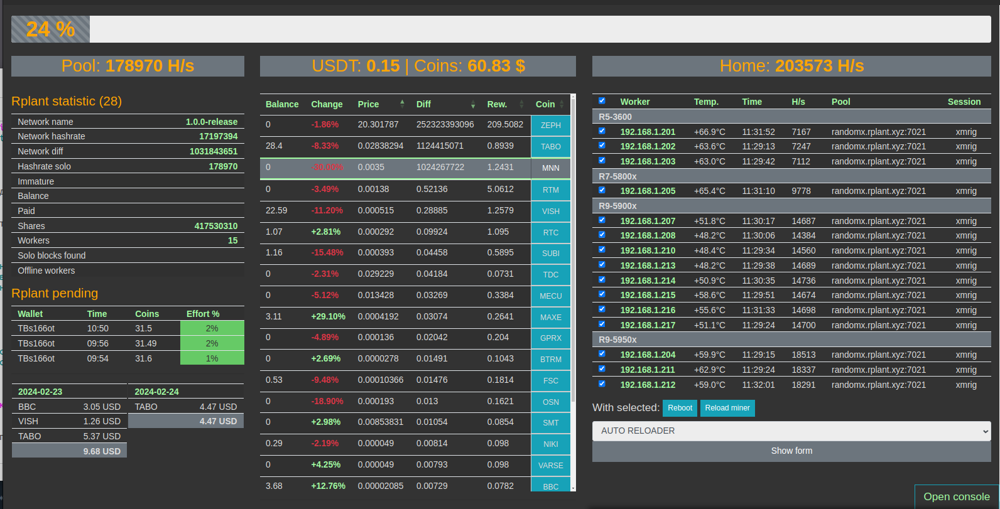

<!DOCTYPE html>
<html lang="en">
<head>
    <meta charset="UTF-8">
    <meta name="viewport" content="width=device-width, initial-scale=1.0">
    <title>ssh2miningHelper</title>
</head>
<body>
    <h1>ssh2miningHelper</h1>
    
   
    <h2>Описание проекта</h2>
    
Этот проект создан для отслеживания состояния сборок для майнинга на CPU.

    
    <h2>Что для этого нужно?</h2>
    <ol>
        <li>Для запуска программы нужны установленные пакеты: PHP, apache2, SSH2</li>
        <li>sudo apt-get install libssh2-1-dev libssh2-1\nsudo pecl install ssh2-1.3.1</li>
        <li>sudo pecl install ssh2-1.3.1</li>
        <li>pecl install -f ssh2</li>
    </ol>
    
    <h2>Ресурсы</h2>
    <ul>
        <li><a href="https://github.com">GitHub</a></li>
        <li><a href="https://www.w3schools.com/html/">HTML на W3Schools</a></li>
    </ul>
    
    <h2>Скриншот</h2>
    
    
    <h2>Лицензия</h2>
    
Этот проект распространяется под лицензией MIT. Подробнее о лицензии можно прочитать в файле <a href="LICENSE">LICENSE</a>.

</body>
</html>
